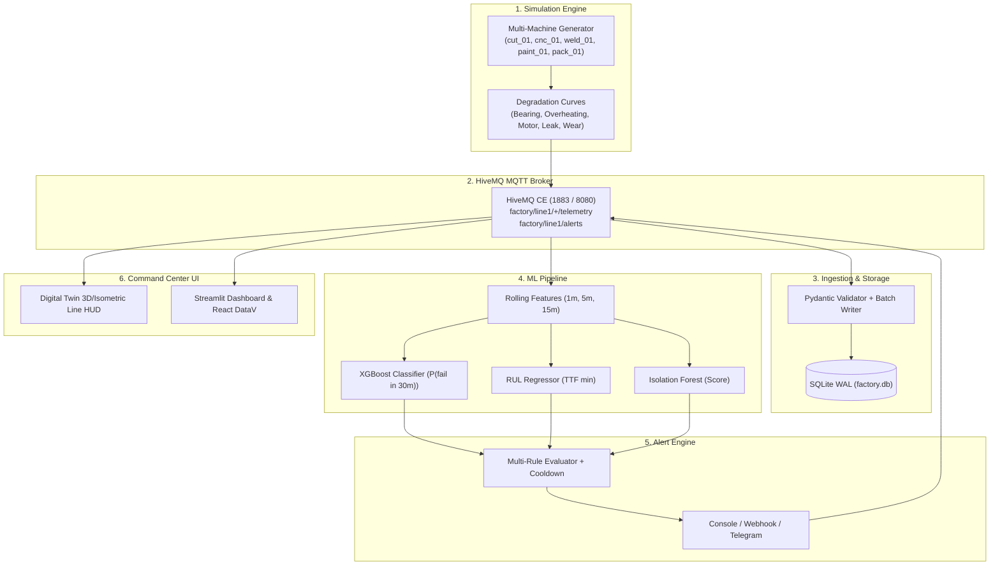

# Smart Production-Line Downtime Prediction

An end-to-end industrial IoT and machine learning predictive maintenance system. Simulates a 5-station continuous manufacturing line, streams high-frequency telemetry via MQTT (HiveMQ), persists data into SQLite (WAL mode), predicts machine failures 15–45 minutes in advance using machine learning (XGBoost/LightGBM + RUL Regressor + Isolation Forest), dispatches alerts with cooldown/escalation, and visualizes operations through a DataV-style interactive digital twin command center.

---

## 🏗️ Architecture Overview



---

## ⚡ Quick Start

### 1. Prerequisites
- Docker & Docker Compose
- Python 3.11+
- Virtual environment (recommended)

```bash
# Clone and enter project
cd downtime-prediction

# Create and activate virtualenv
python3 -m venv venv
source venv/bin/activate

# Install dependencies
make install
```

### 2. Start the HiveMQ Broker
```bash
make broker
```
- MQTT Broker available at `localhost:1883`
- HiveMQ Web Control Center at `http://localhost:8080`

### 3. Generate 30 Days of Historical Batch Data
Generates 720 hours of historical telemetry with realistic degradation curves and labeled downtime events into SQLite in under 2 minutes:
```bash
make seed-data
```

### 4. Train the ML Models
Trains the XGBoost failure classifier, RUL regressor, and Isolation Forest anomaly detector with strict temporal cross-validation:
```bash
make train
```

### 5. Launch the Complete Live Pipeline
In separate terminal windows (or using `docker compose up`):

```bash
# Terminal 1: Ingestion Service
make ingest

# Terminal 2: ML Inference Worker
make predict

# Terminal 3: Alert Engine
make alerts

# Terminal 4: Factory Line Live Simulator
make simulate

# Terminal 5: Streamlit Dashboard
make dashboard
```

---

## 🧪 Demo: Inject Failure & Observe Early Warning
Run the automated demonstration to witness early predictive detection:
```bash
make demo
```
1. Injects gradual **bearing wear** into `cnc_01` (CNC Milling).
2. Spindle vibration ($vib \propto p^{1.8}$) and temperature begin climbing.
3. At $T-30\text{ min}$, the ML classifier detects elevated risk ($P(\text{fail}) > 0.60$).
4. A `PREDICTIVE_MAINTENANCE_WARNING` alert triggers in the dashboard and MQTT topic.
5. The operator receives an estimated Remaining Useful Life (RUL) countdown before the machine reaches terminal `FAULT`.

---

## 📡 Inspecting MQTT Traffic
You can monitor live message streams using standard MQTT tooling:

```bash
# Subscribe to all machine telemetry
mosquitto_sub -h localhost -p 1883 -t "factory/line1/+/telemetry" -v

# Subscribe to real-time ML risk predictions
mosquitto_sub -h localhost -p 1883 -t "factory/line1/predictions/+" -v

# Subscribe to alerts
mosquitto_sub -h localhost -p 1883 -t "factory/line1/alerts" -v
```

---

## ⚙️ Configuration (.env)
Switch seamlessly between local Docker HiveMQ and HiveMQ Cloud (TLS):

```env
BROKER_MODE=local
# For HiveMQ Cloud:
# BROKER_MODE=cloud
# CLOUD_BROKER_HOST=your-id.s1.eu.hivemq.cloud
# CLOUD_BROKER_PORT=8883
# CLOUD_BROKER_USERNAME=factory_op
# CLOUD_BROKER_PASSWORD=SecretPassword!
```

---

## 🧪 Unit Tests
Run the test suite:
```bash
make test
```
Tests cover:
- Machine degradation curves and physical limits
- Causal feature engineering without data leakage
- Alert de-duplication, cooldown, and auto-escalation
- Pydantic telemetry payload schema validation
