# Smart Production-Line Downtime Prediction: Architecture

## 1. System Topology & Data Flow

```mermaid
flowchart LR
    subgraph Physical_Simulation ["Factory Line Simulation (5 Machines)"]
        M1["Cutting Machine (cut_01)"]
        M2["CNC Milling (cnc_01)"]
        M3["Welding Robot (weld_01)"]
        M4["Painting Booth (paint_01)"]
        M5["Packaging Unit (pack_01)"]
    end

    subgraph Messaging ["HiveMQ MQTT Broker (v2 API / TLS)"]
        T1["factory/line1/+/telemetry (QoS 1)"]
        T2["factory/line1/+/status (Retained)"]
        T3["factory/line1/predictions/+ (QoS 1)"]
        T4["factory/line1/alerts (QoS 1)"]
        T5["factory/line1/control"]
    end

    subgraph Ingestion_Storage ["Ingestion & SQLite (WAL)"]
        Val["Pydantic Payload Validator"]
        Batch["Batch Queue Writer"]
        DB[("factory.db (SQLite WAL)")]
    end

    subgraph ML_Inference ["ML & Physics Analytics"]
        FE["Rolling Feature Engineer (1m, 5m, 15m)"]
        XGB["Failure Classifier (XGBoost)"]
        RUL["TTF Regressor (RUL min)"]
        ISO["Anomaly Detector (Isolation Forest)"]
    end

    subgraph Alerts_Service ["Rules & Notification Engine"]
        Rules["Rules Engine (ML + Physical Limits)"]
        Dedup["Cooldown & De-duplication"]
        Notif["Console / Webhook / Telegram"]
    end

    subgraph Dashboard ["Live Command Center (DataV / Streamlit)"]
        Twin["Digital Twin HUD"]
        Osc["Sensor Oscilloscope"]
        AlertsUI["Incident Acknowledgment"]
        Analytics["Pareto & MTBF/MTTR"]
    end

    Physical_Simulation -->|Publishes JSON Telemetry| T1
    T1 --> Val --> Batch --> DB
    T1 --> FE --> XGB & RUL & ISO
    XGB & RUL & ISO --> T3
    T3 & T1 --> Rules --> Dedup --> Notif & T4
    T1 & T3 & T4 --> Dashboard
    Dashboard -->|Inject Failures / Speedup| T5 --> Physical_Simulation
```

## 2. Topic Architecture
- `factory/line1/{machine_id}/telemetry`: High-frequency sensor packet (1 Hz).
- `factory/line1/{machine_id}/status`: Retained machine lifecycle state (`RUNNING`, `WARNING`, `FAULT`).
- `factory/line1/predictions/{machine_id}`: Real-time inference score (`failure_prob`, `predicted_ttf_min`, `anomaly_score`).
- `factory/line1/alerts`: Event-driven notifications with severity (`INFO`, `WARNING`, `CRITICAL`).
- `factory/line1/control`: Operational commands for fault injection, pause, resume, and speedup.

## 3. Failure Degradation Curves
- **Bearing wear**: Non-linear vibration exponent ($vib \propto p^{1.8}$) accompanied by friction-induced heat.
- **Overheating / Cooling failure**: Rapid thermal climb ($temp \propto +35^\circ\text{C} \cdot p^{1.8}$) with auxiliary motor current drag.
- **Motor overload**: High stator current spike with spindle RPM degradation.
- **Hydraulic / Pneumatic leak**: Exponential pressure dissipation ($pressure \propto -3.8\text{ bar}$) with cycle elongation.
- **Tool wear**: Micro-chatter, defect spikes in `reject_count`, and cycle time drift.
